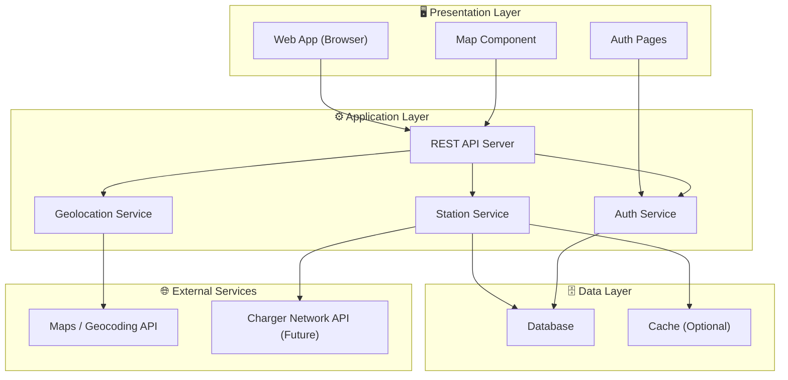
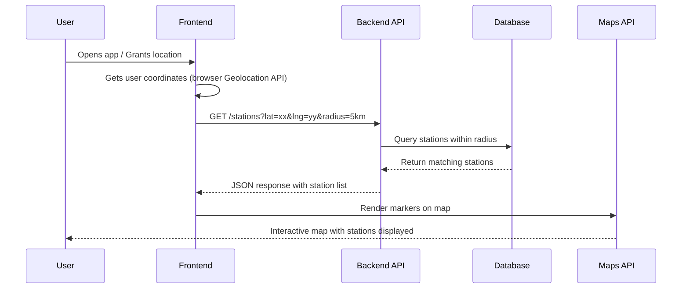
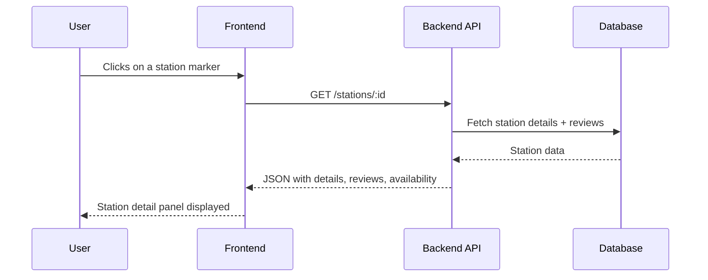
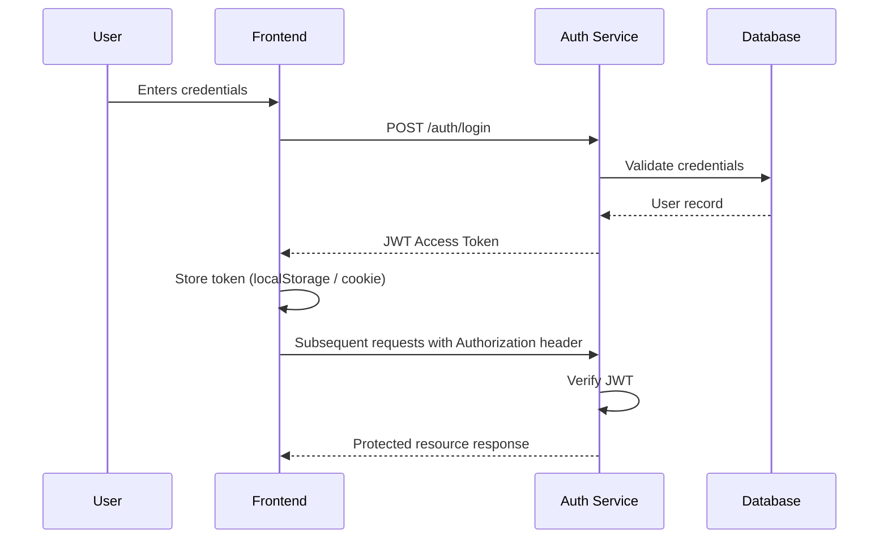

# 🏗️ System Architecture — EV Charging Station Locator

> This document outlines the high-level architecture of the EV Charging Station Locator application. It will evolve as the project matures.

---

## 📐 Architecture Overview

The application follows a **three-tier architecture**:

1. **Presentation Layer (Frontend)** — The user-facing interface with an interactive map and search functionality.
2. **Application Layer (Backend)** — REST API server that handles business logic, authentication, and data processing.
3. **Data Layer (Database)** — Persistent storage for station data, user accounts, reviews, and session information.

---

## 🔗 High-Level System Diagram



---

## 📦 Component Breakdown

### 1. Frontend (Presentation Layer)

| Component         | Responsibility                                      |
| ----------------- | --------------------------------------------------- |
| Map View          | Renders interactive map with station markers         |
| Search & Filters  | Lets users filter stations by type, distance, etc.   |
| Station Detail    | Shows station info, availability, reviews            |
| Auth Pages        | Login, signup, and profile management                |
| Navigation        | Provides directions from user's location to station  |

### 2. Backend (Application Layer)

| Component           | Responsibility                                         |
| ------------------- | ------------------------------------------------------ |
| REST API Server     | Exposes endpoints for frontend consumption              |
| Auth Service        | Handles user registration, login, token management      |
| Station Service     | CRUD operations for charging stations                   |
| Geolocation Service | Resolves coordinates, calculates distances              |
| Search Service      | Handles filtering, sorting, and proximity queries       |

### 3. Database (Data Layer)

| Entity              | Key Fields                                              |
| ------------------- | ------------------------------------------------------- |
| Users               | id, name, email, password_hash, created_at              |
| Stations            | id, name, lat, lng, address, charger_type, status       |
| Reviews             | id, user_id, station_id, rating, comment, created_at    |
| Favourites          | id, user_id, station_id                                 |

> Schema design will be finalized and documented separately.

---

## 🔄 Data Flow

### User Searches for Nearby Stations



### User Views Station Details



---

## 📂 Folder Mapping

```
src/
├── frontend/           # Presentation Layer
│   ├── components/     # Reusable UI components
│   ├── pages/          # Page-level views
│   ├── services/       # API call utilities
│   └── assets/         # Static assets (images, icons)
│
├── backend/            # Application Layer
│   ├── routes/         # API route definitions
│   ├── controllers/    # Request handlers / business logic
│   ├── models/         # Database models / schemas
│   ├── middleware/      # Auth, validation, error handling
│   └── config/         # Environment & DB configuration
```

---

## 🔐 Authentication Flow (Planned)



---

## 🧩 Key Design Decisions

| Decision                     | Rationale                                                    |
| ---------------------------- | ------------------------------------------------------------ |
| REST API over GraphQL        | Simpler to implement for the current scope                   |
| JWT-based Authentication     | Stateless auth suitable for SPAs                             |
| Separate Service Modules     | Clean separation of concerns, easier testing                 |
| Proximity-based Queries      | Core UX requirement — users need "nearby" results            |
| Optional Caching Layer       | Can improve performance for frequently accessed station data |

---

## 🚧 Future Considerations

- **WebSocket support** for real-time availability updates
- **Rate limiting & API throttling** for production security
- **CDN** for static frontend assets
- **Containerization (Docker)** for consistent deployment
- **CI/CD pipeline** for automated testing and deployments

---

> 📝 *This document is a living reference and will be updated as the project progresses through design, development, and deployment phases.*
